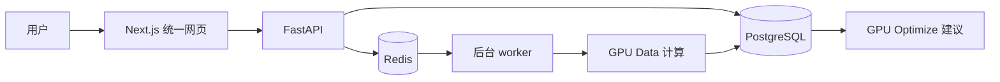

# GPU Cost & Capacity Copilot

面向 GPU 月支出较高、没有专职 FinOps 团队的中小型 AI 公司，提供 GPU 成本审计、利用率分析、优化建议、收益验证和容量预测。

> **当前阶段：可运行的本地产品 MVP。** 已用公开 GPU trace 完成 GPU Data → GPU Optimize 实机验证；尚未通过真实客户数据、建议执行和付费试点验证商业价值。

## 产品驾驶舱

| 产品 | 回答的问题 | 当前能力 | 状态 | 下一道门槛 |
|---|---|---|---|---|
| **GPU Data** | 数据可信吗？钱花在哪里？GPU 如何使用？ | 四表导入、字段审计、成本与利用率基线、闲置线索、报告 | ✅ 本地 MVP；公开数据已验证 | 真实客户账单与遥测对账 |
| **GPU Optimize** | 应调整哪些资源或采购配置？ | 读取合格分析结果、生成有证据和风险的建议、人工审核状态、报告 | 🟡 最小闭环已接入；容量模块可独立运行 | 验证 Rightsizing 可执行性与实际节省 |
| **GPU Improve** | 建议执行了吗？收益实现了吗？ | 行动台账、前后对比、收益验证、证据等级 | 🟡 独立本地 MVP | 接入统一网页并验证一次真实行动 |
| **GPU Forecast** | 未来需要多少 GPU？何时采购或扩容？ | 数据准备度、滚动回测、容量情景、采购计划 | 🟡 独立本地 MVP | 接入统一网页并用真实历史需求回测 |

状态含义：✅ 已通过当前阶段实机验收；🟡 功能可运行，但仍缺真实业务证据。

## 已经做成的闭环

```text
Alibaba PAI 公开 GPU trace + Azure 官方公开价格
                         ↓
              四表转换与数据质量门
                         ↓
        GPU Data 成本、利用率、闲置调查线索
                         ↓
          GPU Optimize 可审核建议与报告
                         ↓
              PostgreSQL 持久化与租户隔离
```

实测公开案例：

| 指标 | 结果 |
|---|---:|
| GPU 数量 | 20 |
| GPU-hours | 2590.025833 |
| 公开价格对照成本 | 1362.353588 USD |
| GPU 利用率中位数 | 2.645860% |
| GPU 利用率 P95 | 84.972965% |
| 遥测覆盖率 | 100% |
| Optimize 待审核建议 | 7 条 |
| 对外宣称的理论节省 | 0 USD |

独立基准与产品结果一致。关键字段缺失和遥测缺失案例会被阻断，缺失利用率不会被当成零。公开数据无法证明客户折扣、商业 SLA 和容量可回收性，因此相关成本不会被写成节省金额。

## 当前系统

统一入口由 Next.js、FastAPI、PostgreSQL、Redis 和后台 worker 构成。支持本地登录、组织和项目选择、四产品入口、异步任务、幂等键、结果持久化和 PostgreSQL RLS 租户隔离。Docker 数据固定保存在 `E:\DockerData\gpu-saas`。



## 一分钟运行

前提：Windows、Docker Desktop，且 `E:` 盘可用。

```powershell
cd "D:\南工\练习册\gpu-cost-capacity-optimization\.worktrees\gpu-forecast-product"
.\scripts\local-stack.ps1 start
```

打开 [http://localhost:3000](http://localhost:3000)。登录信息保存在本地 `.env` 的 `LOCAL_DEV_EMAIL` 和 `LOCAL_DEV_PASSWORD`，该文件不会提交到 Git。

体验完整流程：进入 **GPU Data** → 选择“使用公开验证案例” → 运行分析 → 下载报告 → 进入 **GPU Optimize** → 生成建议 → 下载建议报告。

```powershell
.\scripts\local-stack.ps1 status
.\scripts\local-stack.ps1 logs
.\scripts\local-stack.ps1 stop
```

详细故障排查见 [Windows 本地运行说明](docs/operations/local-stack.md)。

## 真实验证证据

- 194 项回归测试通过：SaaS 40、GPU Data 31、GPU Optimize 38、GPU Improve 45、GPU Forecast 40。
- Next.js 生产构建通过。
- 正常、关键字段缺失、遥测缺失三个公开案例均经过真实 Docker API 和 worker 运行。
- 分析结果、建议和组织/项目记录在全栈重启后仍存在。
- 另一租户无法读取结果，跨租户写入被 PostgreSQL RLS 拒绝。
- 公开数据、转换字段、许可、校验值和价格查询日期可回查。

验证方法和字段证据见 [GPU Data 公开数据专业验证](docs/validation/public-gpu-data.md)。详细完成记录见 [CURRENT_STATE.md](CURRENT_STATE.md)。

## 当前问题

| 优先级 | 问题 | 为什么关键 | 完成标准 |
|---|---|---|---|
| **P0** | 没有真实客户数据与授权 | 公开数据只能证明程序和口径，不能证明客户价值 | 一家团队提供脱敏账单、遥测和 SLA 范围并完成对账 |
| **P0** | 优化建议尚未执行 | 无法证明容量可回收或 SLA 是否受影响 | 客户批准一个低风险建议，记录执行和回滚 |
| **P0** | 没有实际收益证据 | 当前不能把相关成本称为节省 | GPU Improve 完成执行前后可比验证 |
| **P1** | 缺少正式只读连接器 | CSV 上传不适合长期使用 | 先完成一个 Azure 或 Kubernetes/Prometheus 增量同步 |
| **P1** | Improve、Forecast 未完整进入统一网页 | 四产品体验仍然割裂 | 统一登录、租户、任务和持久化结果贯通 |
| **P2** | 尚未公网部署 | 外部客户无法安全访问 | HTTPS、正式身份、云数据库、对象存储、备份和监控通过验收 |
| **P3** | 支付、SSO 与合规未完成 | 影响正式规模销售 | 出现付费客户和企业采购要求后实施 |

## 下一步进化顺序

```text
真实客户数据验证
        ↓
建议人工审核与一次低风险执行
        ↓
GPU Improve 实际收益验证
        ↓
首个只读数据连接器
        ↓
统一接入 Improve / Forecast
        ↓
公网试点、定价与付费验证
```

当前最有价值的证据是：客户承认问题存在、愿意执行一条建议，并能测出结果。支付、企业 SSO、复杂数据平台和自动修改 GPU 等能力应在出现真实需求后实施。

职责和阶段门槛见 [产品演进路线](docs/roadmap/production-saas.md)。

## 文档导航

| 想了解什么 | 文档 |
|---|---|
| 当前真实状态、约束和未完成事项 | [CURRENT_STATE.md](CURRENT_STATE.md) |
| 产品定位、客户和商业边界 | [产品设计.md](产品设计.md) |
| 四产品输入、输出、规则与验收 | [四平台正式规格.md](四平台正式规格.md) |
| 公开数据来源、字段映射和验证结果 | [公开数据验证](docs/validation/public-gpu-data.md) |
| 本地环境启动与故障排查 | [本地运行说明](docs/operations/local-stack.md) |
| 真实客户试点门槛 | [产品演进路线](docs/roadmap/production-saas.md) |
| 各产品详情 | [GPU Data](gpu-data/) · [GPU Optimize](gpu-optimize/) · [GPU Improve](gpu-improve/) · [GPU Forecast](gpu-forecast/) |

## 产品边界

- 当前产品只提供只读分析和人工审核建议，不自动修改云资源、GPU 或 Kubernetes 对象。
- Azure 公开价格只是对照数据，不是 Alibaba 成本或客户成交价。
- 理论节省、批准节省和实际收益严格分开。
- 本地开发登录不等同于正式互联网身份系统。
- 真实客户账单、密钥、令牌和个人敏感信息不得保存到 Git 或 Notion。

## License

[MIT License](LICENSE)
